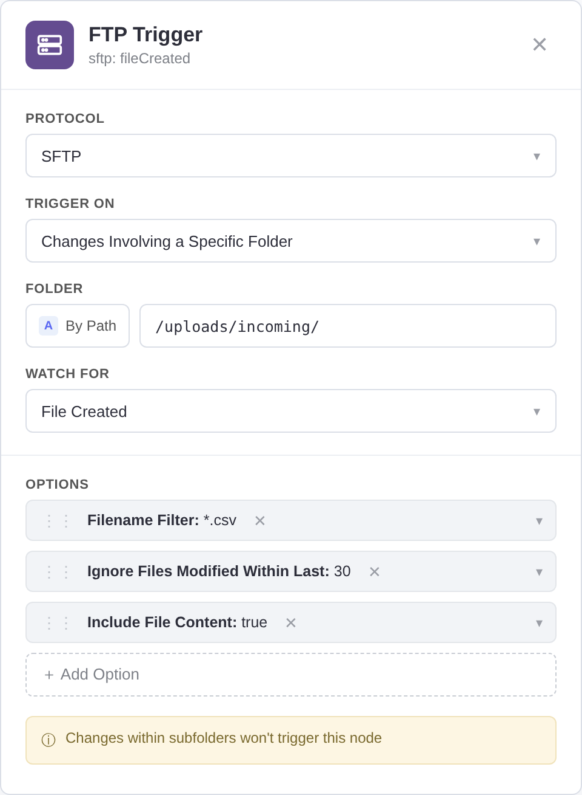

# (S)FTP Trigger Node for n8n


The FTP Trigger node is a custom-built node for n8n that triggers a workflow on FTP or SFTP filesystem changes. The node listens to a specified FTP or SFTP server and triggers a workflow when a specific event occurs. Events can include file or folder creation, deletion, or updates. The node can monitor a specific folder or a specific file.

[n8n](https://n8n.io/) is a [fair-code licensed](https://docs.n8n.io/reference/license/) workflow automation platform.




## Features
* Support for both FTP and SFTP protocols.
* Ability to trigger on various filesystem events.
* Support for watching specific files or folders.
* Optional glob-based filename filter (e.g. `*.csv`).
* SFTP private key authentication (including keys pasted as single-line strings).
* Optional **file content download**: attach the file as binary data directly in
  the trigger output.
* Optional **stability window**: wait until files stop changing before
  triggering, so partially uploaded files are not picked up too early.
* Connection timeouts so a unreachable server cannot hang polling.

## Compatibility

Requires n8n **1.241+** and works with **n8n 2.x** (Node.js >= 20.19). Community
nodes are installed through the n8n UI (**Settings → Community nodes →
Install a community node**) using the package name
`n8n-nodes-ftp-trigger-owen` — see the
[installation guide](https://docs.n8n.io/integrations/community-nodes/installation/)
in the n8n community nodes documentation.

> This is a fork of [`drudge/n8n-nodes-ftp-trigger`](https://github.com/drudge/n8n-nodes-ftp-trigger)
> by Nicholas Penree, republished under a new npm name because the original
> package name is held upstream.

## Events

* **File Created**: Triggered when a new file is created in the specified folder or directory.
* **File Updated**: Triggered when an existing file in the specified folder or directory is updated.
* **File Deleted**: Triggered when a file is deleted from the specified folder or directory.
* **Folder Created**: Triggered when a new folder is created in the specified directory.
* **Folder Deleted**: Triggered when a folder is deleted from the specified directory.
* **Folder Updated**: Triggered when an existing folder in the specified directory is updated.
* **Watch Folder Updated**: Triggered when the watched folder itself is modified.

## Options

* **Filename Filter**: A glob pattern (e.g. `HR_Feed*.csv`) to limit which files
  can trigger the node. Leave empty to match all files. Only direct children of
  the watched folder are considered.
* **Ignore Files Modified Within Last**: When set to a number of seconds (e.g.
  `30`), files modified within the last 30 seconds are not emitted yet — they
  may still be uploading. Once a file has not changed for the whole window, its
  event is emitted on a later poll automatically. Set to `0` to disable. The
  window is bypassed during manual test runs (*Fetch Test Event*), so testing
  stays convenient.
* **Include File Content**: Downloads each emitted file and attaches it as
  binary data (property `data`) on the item, so downstream nodes can process the
  file directly. Not available for folder events or file deletions. The MIME
  type is detected from the file extension. If a download fails, the item still
  triggers and carries a `downloadError` field with the reason.

## Notes

* On the first check after activation the node only records the current state of
  the watched folder — it does not emit events for files that already exist.
  Use the *Fetch Test Event* button in manual mode to get the current listing as
  test data.
* Changes within subfolders don't trigger the node (non-recursive monitoring).
* For SFTP, private keys can be pasted as multi-line PEM blocks or as
  single-line strings with literal `\n` sequences; both formats are normalized
  automatically.
* File updates are detected by comparing both modification time and size, so
  even writes within the same second are caught.
* The trigger tracks a snapshot of the watched folder in the workflow's static
  data (capped at 10,000 entries; oldest entries are pruned first for very
  large folders).

## Credentials

You can use your existing n8n FTP or SFTP credentials. The credential can be
validated directly from the node using the built-in connection test.

## Development

```bash
npm install
npm run build
npm test                  # unit tests
RUN_INTEGRATION=1 TZ=UTC npm test # + integration tests against real local FTP/SFTP servers
```

See [CONTRIBUTING.md](./CONTRIBUTING.md) for architecture notes and the release
process, and [CHANGELOG.md](./CHANGELOG.md) for the version history.

## Resources

* [n8n community nodes documentation](https://docs.n8n.io/integrations/community-nodes/)

## Contribution

If you find any bugs, or want to contribute to the further development of this node, please create an issue or a pull request in this repository.

## Disclaimer

This project is in no way affiliated with, authorized, maintained, sponsored, or endorsed by n8n or any of its affiliates or subsidiaries. This is an independent and unofficial software. Use at your own risk.
